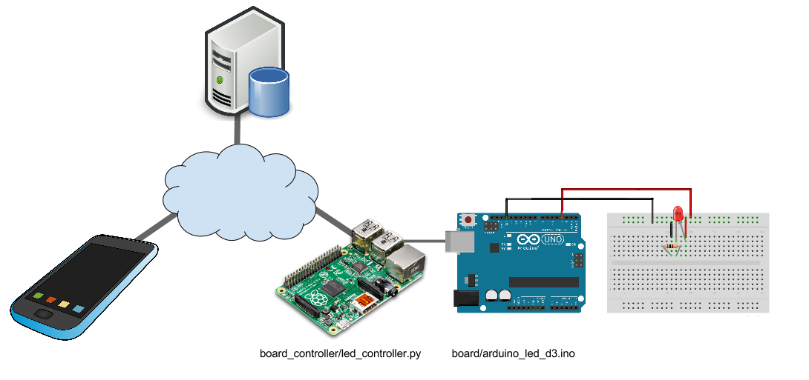

### Arduino Remote

Monitor and control a sensor connected to Arduino using a REST client. The server part of this project is [here](https://github.com/shoaibk/arduino-server).



#### Board
The Arduino programs (sketch) are in folder ```board/arduino_led/```. They should be uploaded to the Arduino board using the [Arduino GUI](https://www.arduino.cc/en/Main/Software).

#### Board Controller
The folder ```board_controller``` contains the python program that connects to the remote Rails server and sends control signal to the Arduino through serial interface.


